_SuperDataScience-Tableau-2018-Advanced course | jukka.kansanaho@gmail.com | 2019-08-19_

# SuperDataScience-Tableau-2018-Advanced

This course is the first course in SuperDataScience's Business Intelligence (BI) Analyst Learning path (https://www.superdatascience.com/paths).

The courses on this path are:
* Tableau 2018
* Power BI A-Z
* Tableau 2018 Advanced
* Tableau Expert
* Tableau for Business Analytics and Marketing

Tableau 2018 Advanced course page: https://www.superdatascience.com/courses/tableau-2018-advanced-master-tableau-in-data-science

# Visualizations
Here are Tableau visualizations from this course.

## Module-2: Groups and Sets
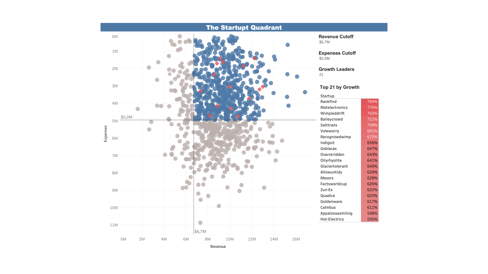
*The Startup Quadrant - Dashboard*

## Module-3: Advanced table Calculations
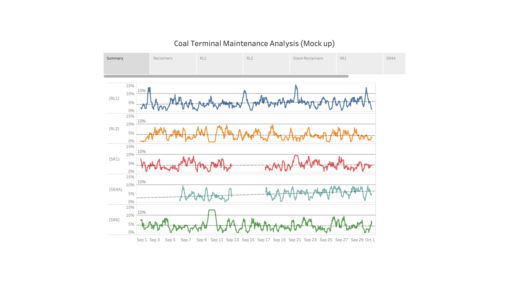
*DBCT Coal Terminal - Overall Summary*

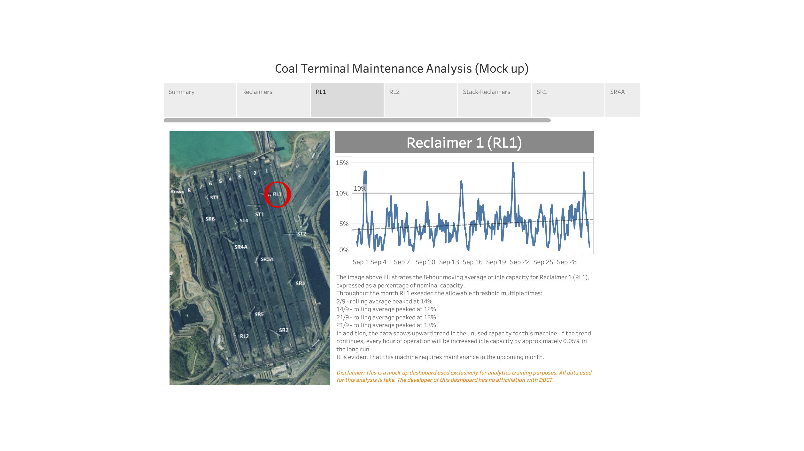
*DBCT Coal Terminal - Reclaimer-1*

## Module-4: Advanced Data Prep + Analytics in Tableau
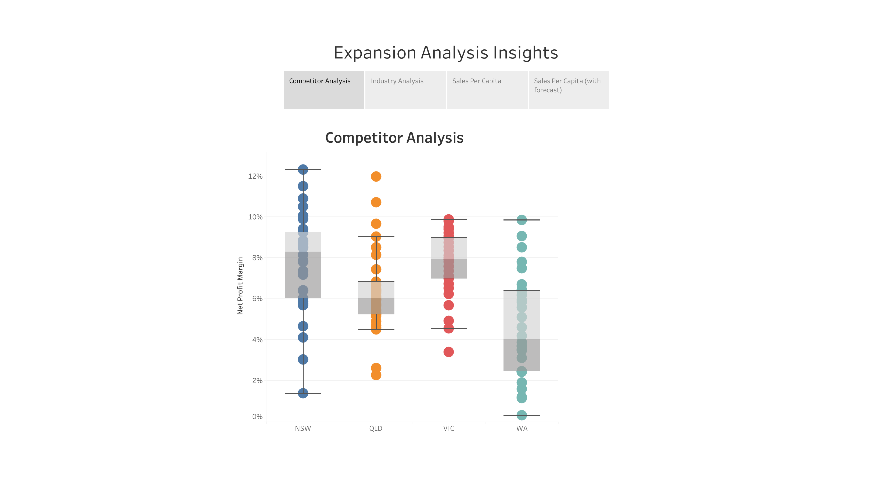
*Expansion Analysis Insights - Competitor Analysis*

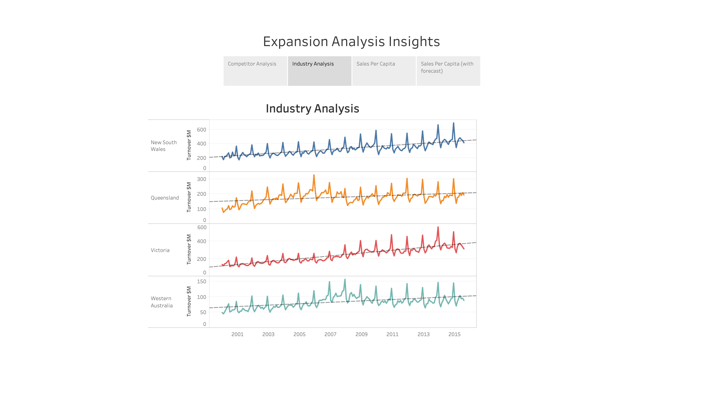
*Expansion Analysis Insights - Idustry Analysis*

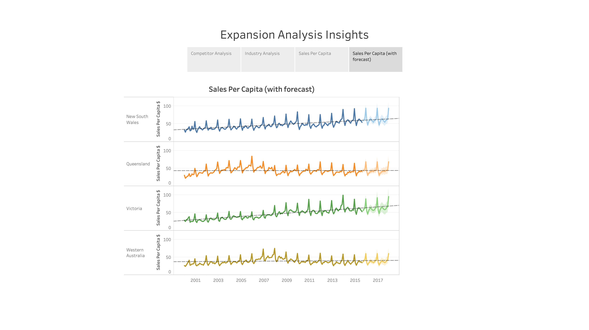
*Expansion Analysis Insights - Sales Per Capita (with forecast)*

## Module-5: Creating Animations in Tableau
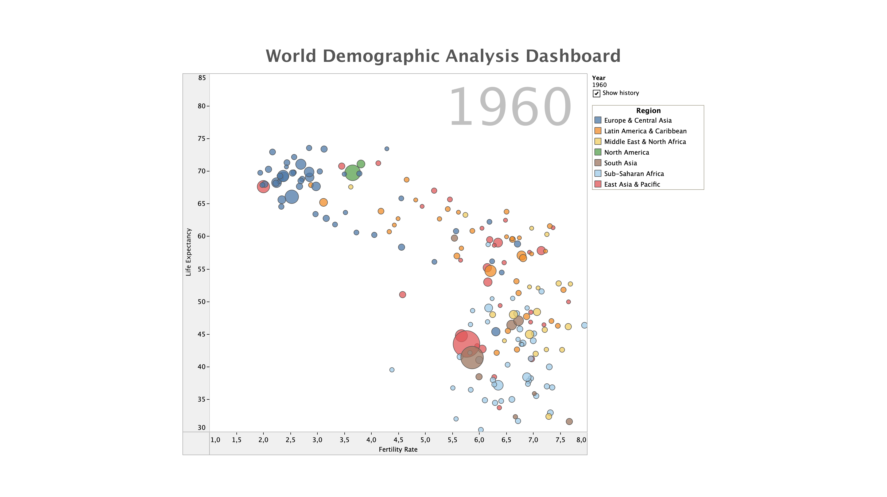
*[World Demographics Analysis Dashboard - 1960*

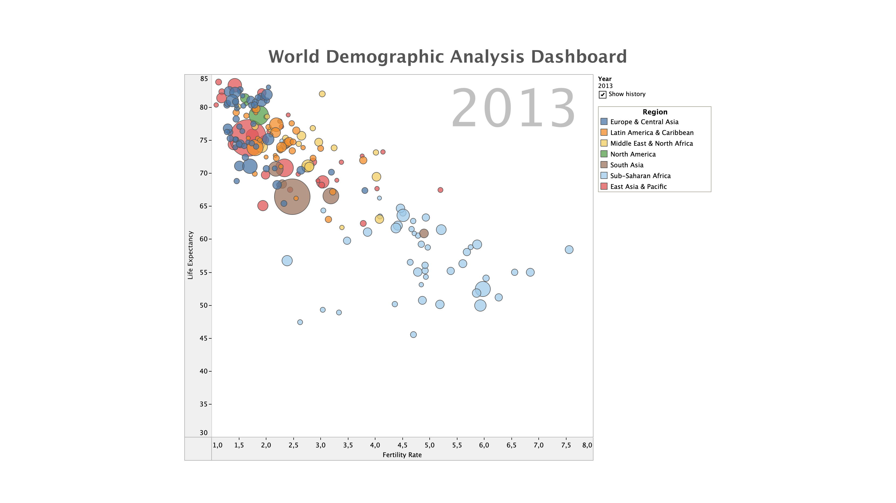
*[World Demographics Analysis Dashboard - 2013*

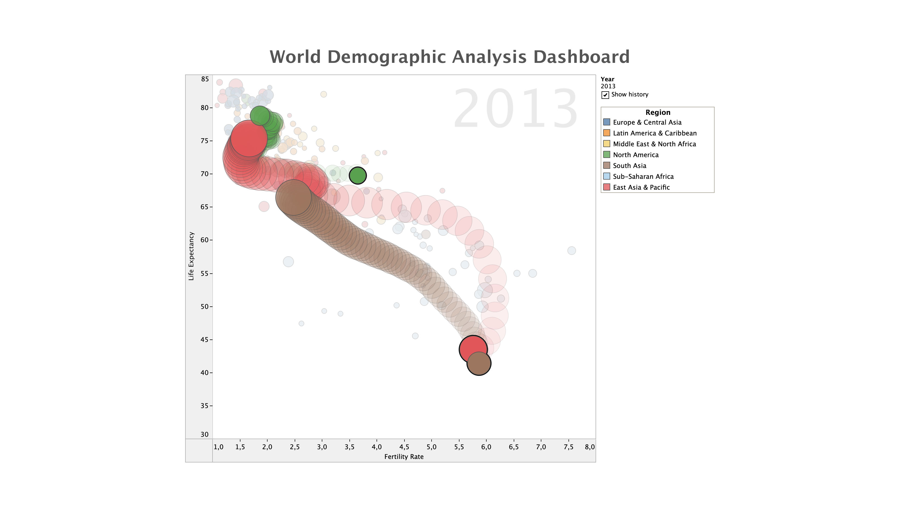
*[World Demographics Analysis Dashboard - Historical change (China, India, US)*

## Module-6: Level Of Detail Calculations (LOD)
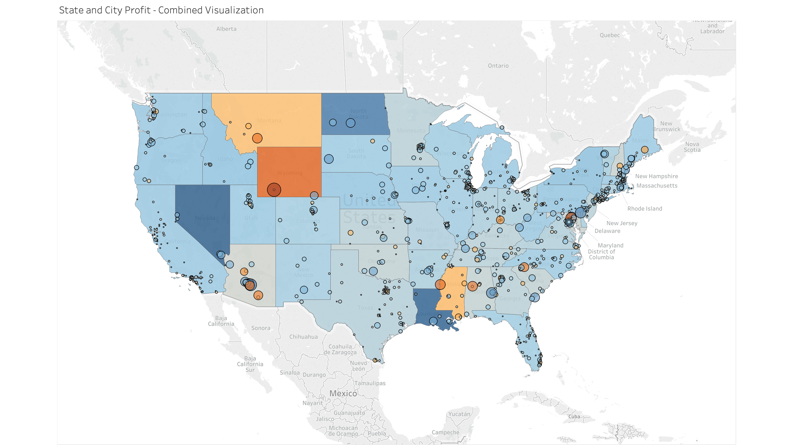
*State and City Profit - Combined view*

## Module-7: Advanced Mapping Techniques
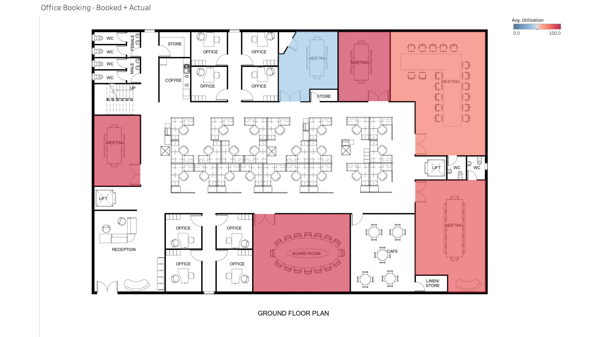
*Crowded Office - Booked*

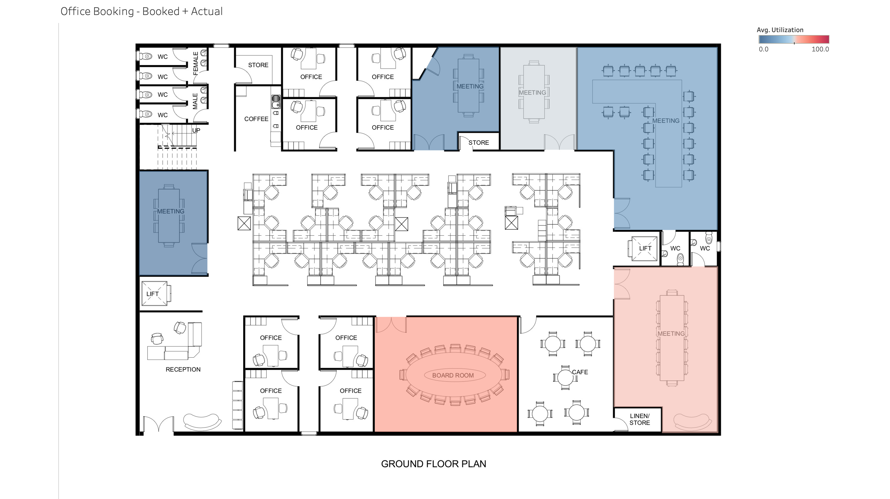
*Crowded Office - Actual*

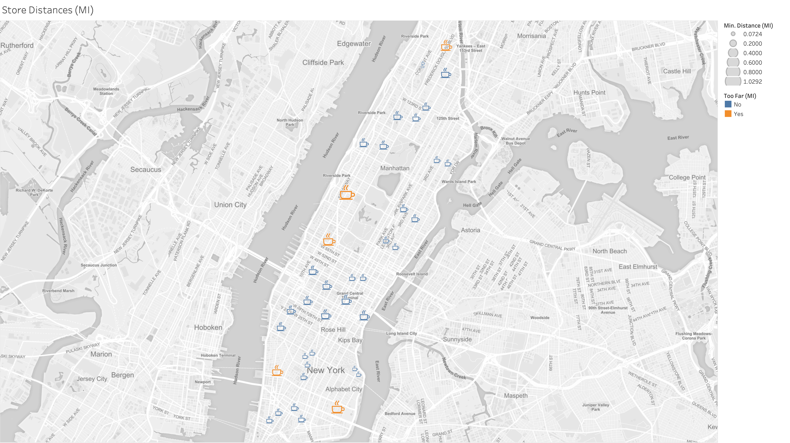
*Megabucks Coffee Company - NYC Coffee Shops*
